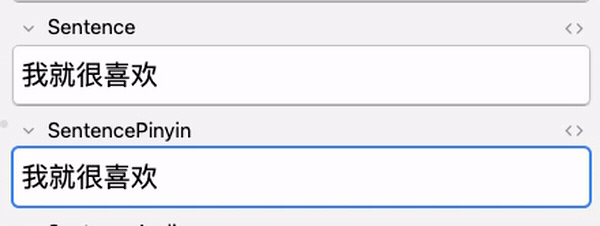
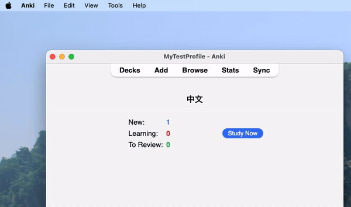

<h1 style="font-family: monospace;">Hanzi2Ruby</h1>
<!-- Anki Rate -->

[//]: # (<!-- Anki Add-On -->)
<!-- GitHub Release -->

## Description
This [Anki](https://apps.ankiweb.net/) add-on lets you add Pinyin and Zhuyin readings above Chinese characters 
(Hanzi) in **any field** of your choosing. 

It works by converting your Chinese text into [ruby](https://en.wikipedia.org/wiki/Ruby_character) annotations, where 
the Pinyin appears as small text 
above the original characters, making it easier to read and study Chinese text.

_[Why hanzi2ruby when there are other great add-ons?](#why-hanzi2ruby-when-there-are-other-great-add-ons)_

⚠️ For the [ruby](https://en.wikipedia.org/wiki/Ruby_character) annotation to work please 
read the [Anki documentation on Ruby characters](https://docs.ankiweb.net/templates/fields.html?highlight=furigana#ruby-characters) 
OR use this basic [Anki note type](https://github.com/alyssabedard/Hanzi2Ruby-notetype) made specifically for this add-on.

> _Need help? Want to raise an issue? Looking for documentation? See [Contributing & Support](#contributing--support)_

一个自动将汉字转换为带拼音注音的 ruby 格式文本的 Anki 插件，可应用于任何字段。

<b>Example</b>

| Type          | Pinyin                                                                        | Zhuyin                                                                         |
|---------------|-------------------------------------------------------------------------------|--------------------------------------------------------------------------------|
| Hanzi         | 你好                                                                            | 你好                                                                             |
| Hanzi to Ruby | `你[nǐ]好[hǎo]`                                                                 | `你[ㄋㄧˇ]好[ㄏㄠˇ]`                                                                 |
| HTML Code     | `<ruby>你<rt>nǐ</rt></ruby><ruby>好<rt>hǎo</rt></ruby>`                         | `<ruby>你<rt>ㄋㄧˇ</rt></ruby><ruby>好<rt>ㄏㄠˇ</rt></ruby>`                         |
| HTML Output   | 
<ruby>你<rt>nǐ</rt></ruby><ruby>好<rt>hǎo</rt></ruby>
 | 
<ruby>你<rt>ㄋㄧˇ</rt></ruby><ruby>好<rt>ㄏㄠˇ</rt></ruby>
 |

## Demo

 
   
    
⬇️

   

    
Demo with Pinyin

    
 
       
    

    
Demo with Zhuyin

    
 
        
    

    
Demo Tools settings (macOS)

    
 
        
    

## Features
- [x] Pinyin support - _Browse_ editor dialog
- [x] Pinyin support - _Add_ editor dialog
- [x] Zhuyin (Bopomofo) support 
- [x] Note Type that supports ruby text for Chinese

Key benefits:
- Works with any field name of your choosing (No restrictions)
- Simple and reliable functionality

### Planned Features
- [ ] Bulk add/remove - tools menu
- [ ] Jyutping and Cantonese support
- [ ] Xiao'erjing (Xiaor jin/Xiaojing/Arabic-Persian script) support

I plan on making additional Chinese language tools will be 
released as separate add-ons to maintain simplicity and modular design as 
I prefer single-purpose add-ons

## Why hanzi2ruby when there are other great add-ons?
This add-on focuses on simplicity and flexibility. While many add-ons offer extensive features, 
they often come with drawbacks:
- Break when Anki or Qt versions are updated
- Restrict you to specific field names
- Bundle multiple features you might not need

## Important Notes
**OS**  
This script has been primarily tested on macOS.  I currently don't have access to a Linux and Windows machines for thorough testing.

## Documentation
🚧 Documentation in progress:
- A user guide for non-technical language learners
- Technical documentation for developers (requirements, dependencies, architecture, etc.)

It will be available in the [docs](docs) folder

## Contributing & Support

| Type                                                                   | Description                                      |
|------------------------------------------------------------------------|--------------------------------------------------|
| [Issues & Requests](https://github.com/alyssabedard/Hanzi2Ruby/issues) | Bug reports or feature requests                  | 
| [Contributing](.github/CONTRIBUTING.md)                                | Fork the repo and submit a PR                    |
| [Discussions](https://github.com/alyssabedard/Hanzi2Ruby/discussions)  | Getting help and questions                       |
| [Support](.github/SUPPORT.md)                                          | Support - Getting Started                        |

[//]: # (| Help Wanted                                                            | Need help with OS-specific documentation/testing |)

## Credits
### Libraries
**jieba**
- [PyPi](https://pypi.org/project/jieba/)
- [GitHub](https://github.com/fxsjy/jieba)

**pypinyin**
- [PyPi](https://pypi.org/project/pypinyin/)
- [GitHub](https://github.com/mozillazg/python-pinyin)

### Other
**Anki SVG logo**
- [Glutanimate](https://glutanimate.com/logos/ankiweb-rate.svg)
