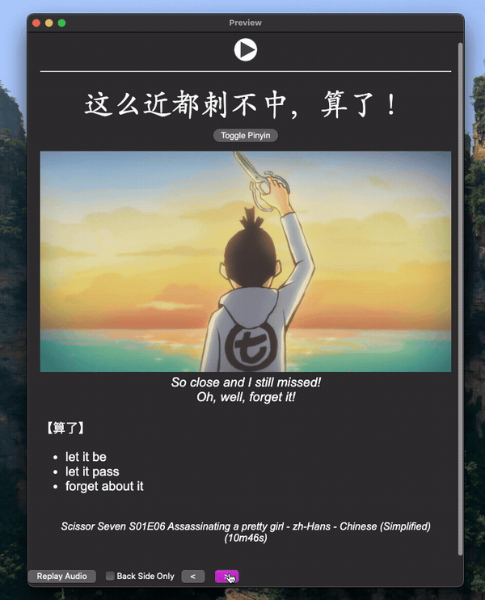

<h1 style="font-family: monospace;">Hanzi2Pinyin - Quick Start Guide</h1>
🚧 COMING SOON !!!  🚧 

For now :

1. Import <a href="https://github.com/alyssabedard/Hanzi2Pinyin-notetype">THIS</a> Anki note type for Hanzi2Pinyin add-on

You should find 2 example cards inside !! 

2. Optional - How to change phonetics

3. For any cards - Add pinyin/zhuyin (INSIDE <b>SentencePinyin</b> field!!!!!!)

4. Voilà ! 

